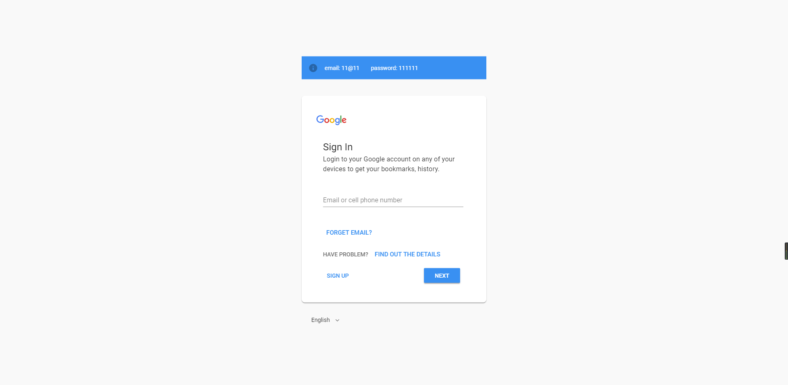
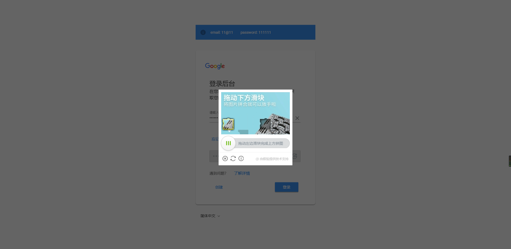
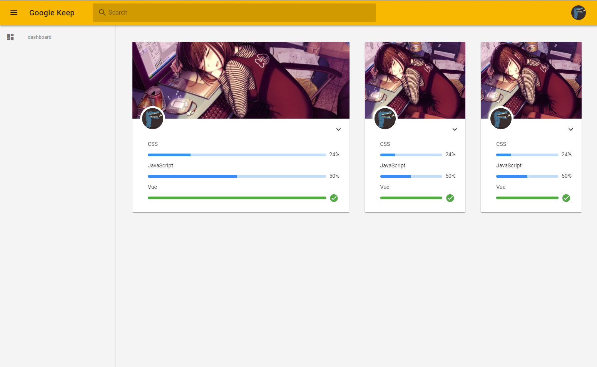

# spa-demo
> 使用到的技术

- [x] Vue

- [x] vuex

- [x] axios

- [x] less

- [x] vuetify

- [x] js-cookies

- [x] vue-i18n

- [x] vue-router

- [x] 极客验证


# 预览







## Build Setup

``` bash
# install dependencies
npm install

# serve with hot reload at localhost:8080
npm run dev

# build for production with minification
npm run build

# build for production and view the bundle analyzer report
npm run build --report

# run unit tests
npm run unit

# run all tests
npm test
```
